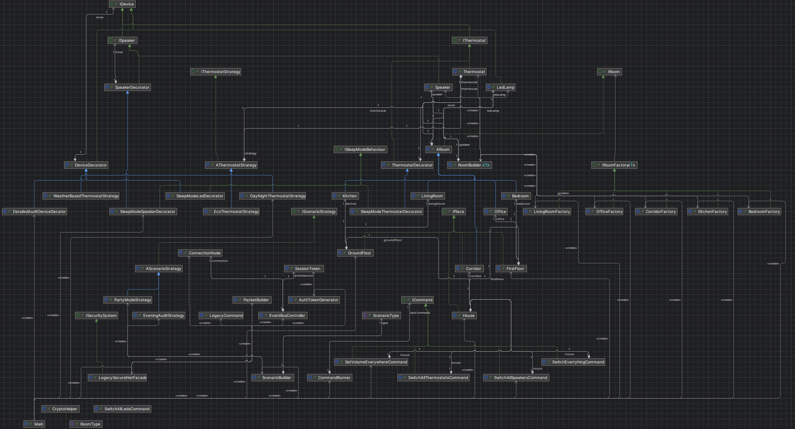

# Smart Home Hub

A Java application for managing a smart home: lights, thermostats and speakers organised into rooms and floors, controlled one by one or all at once. Built as a university OOP project, with the goal of applying **seven design patterns** to a realistic set of business requirements.

**Tech:** Java, Gradle, IntelliJ IDEA

## Features

- **Devices:** SmartGlow LED bulb, ThermoPro thermostat and SoundMax multiroom speaker. Each device has a name, a type and a room, and can be switched on and off.
  - Thermostat: temperature can be changed (one thermostat per room).
  - Speaker: volume can be set, capped at 30 in the bedroom.
- **House structure:** the house contains a ground floor (living room, kitchen, hallway) and a first floor (bedroom, office). A command sent to a device, room, floor or the whole house is passed down to every device below it.
- **Switch-all commands:** for example, switching everything in the house on or off with one call.
- **Scenarios:** named lists of actions that can be run in one go.
- **Thermostat modes:** the thermostat can be given an automatic algorithm (Eco, Day/Night, Weather-based) that can be swapped at runtime, or set manually, which turns the automatic logic off.
- **Device extensions:** a detailed audit mode (logs date, time and device name on every switch) and a sleep mode (ignores requests after 22:00). They can be stacked on one device and removed at any time.
- **Legacy alarm integration:** two simple actions, *Arm Alarm* and *Check Smoke Detector*, hide the 5-step low-level protocol of the old LegacySecureNet system.

## Design patterns

| Pattern | Where | What it solves |
| --- | --- | --- |
| **Builder** | `RoomBuilder` | Creates the different room types (`IRoom`) step by step. |
| **Factory** | `IRoomFactory` | Adds room-specific logic while rooms are being created. |
| **Strategy** | `IScenarioStrategy`, `IThermostatStrategy` | Interchangeable scenarios and thermostat modes. Decorator was not suitable for thermostat modes, because each mode wants to set a different temperature. |
| **Composite** | house, floors, rooms, devices | One tree structure, so a command on any node reaches every device beneath it. |
| **Decorator** | package `device.decorator` | Audit and sleep modes added to a device without changing its core behaviour. |
| **Command** | `ICommand`, `CommandRunner` | Every user action is an object executed by a runner. |
| **Facade** | `ISecuritySystem`, `LegacySecureNetFacade` | Two simple methods in front of the legacy alarm library's connect, authorise, subscribe, send and clean-up sequence. |

## Architecture

The full class diagram is below.



## Testing

The project is covered by several kinds of tests:

- **Unit tests with JUnit**
- **Parameterized tests** with fluent assertions (AssertJ)
- **London-school unit tests** using mocks to isolate the class under test (Mockito)
- **Integration tests**

Run them with:

```bash
./gradlew test
```

## Running the project

**Requirements:** JDK 21 and IntelliJ IDEA (or any IDE with Gradle support).

1. Clone the repository and open it in IntelliJ as a Gradle project.
2. Build:
   ```bash
   ./gradlew build
   ```
3. Run the application from IntelliJ by launching `<MainClass>`.

## Out of scope

The optional Visitor-based extension from the assignment was not implemented.
